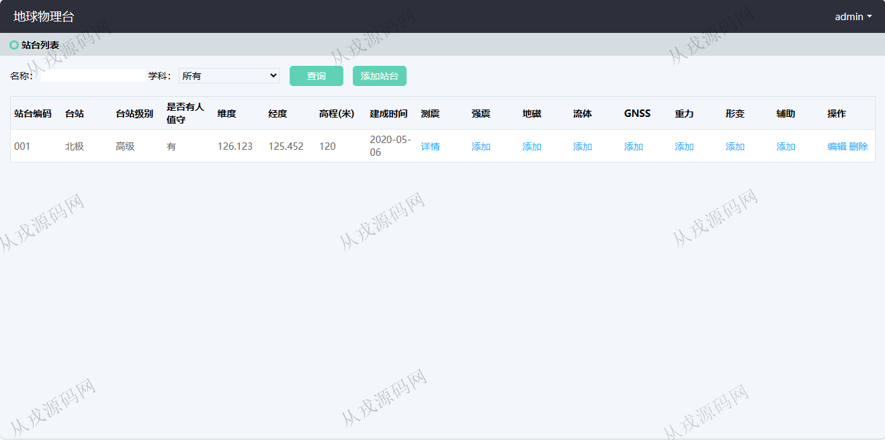
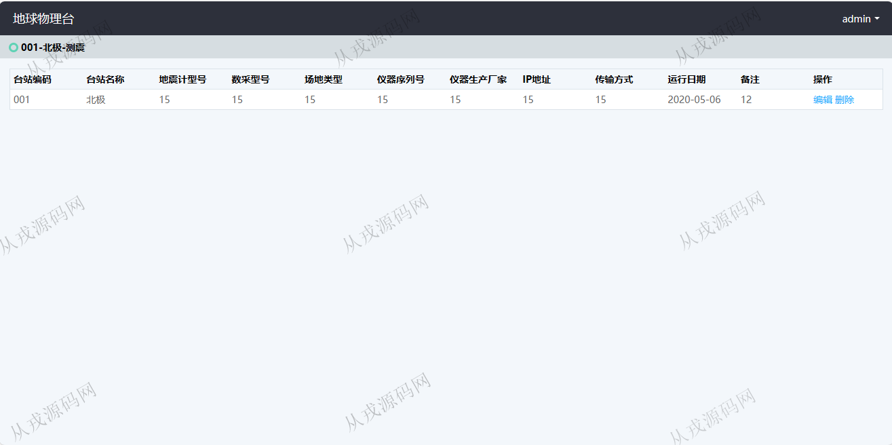
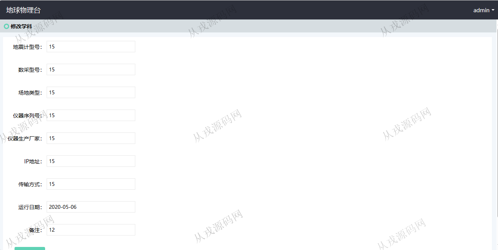
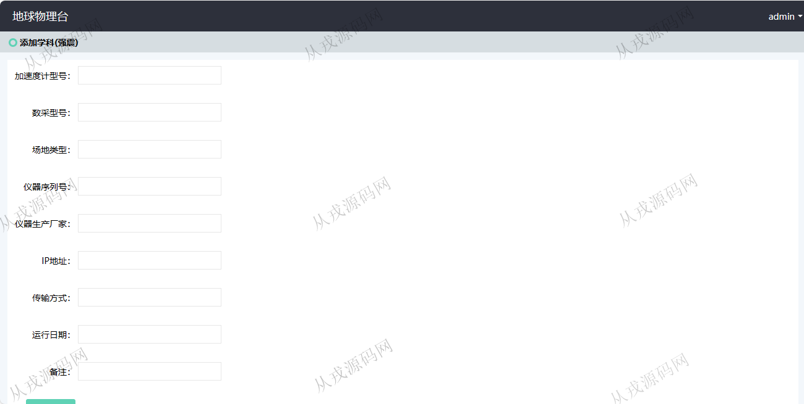
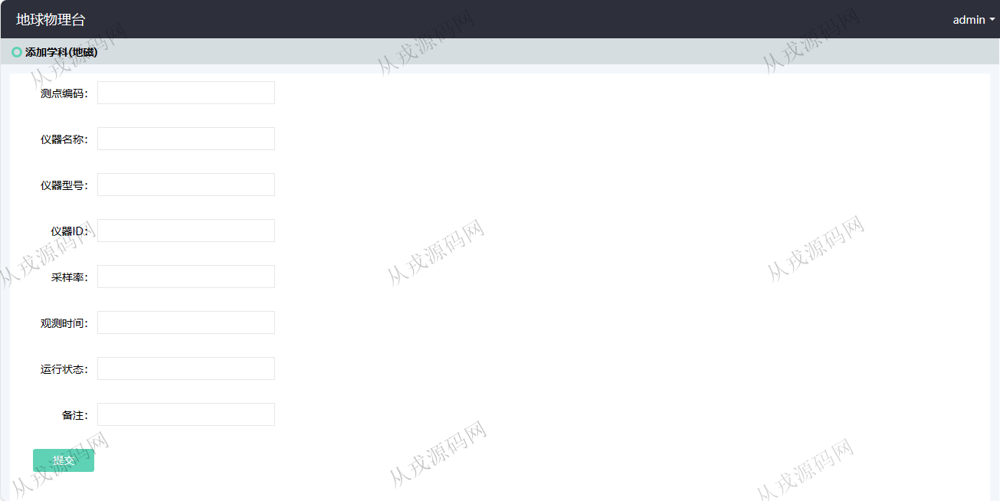
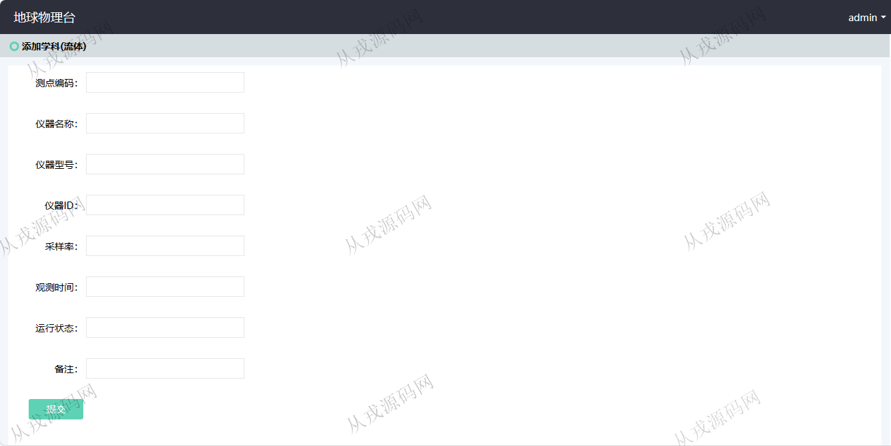
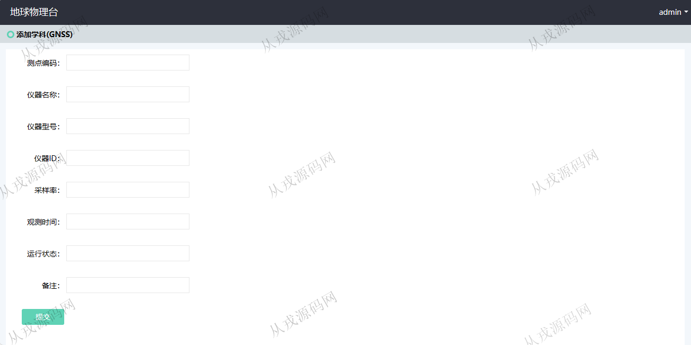
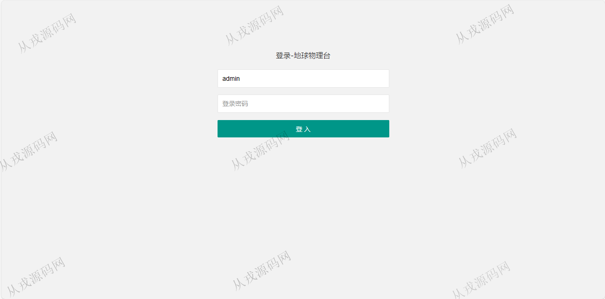

<h1 align="center">185.地球物理台管理系统</h1>

 获取sql文件 QQ: 386869957 QQ群: 377586148 

 [更多源码项目: 从戎源码网](https://armycodes.com/) 

## 简介

> 本代码来源于网络,仅供学习参考使用!
>
> 提供1.远程部署/2.修改代码/3.设计文档指导/4.框架代码讲解等服务
>
> http://localhost:8080/login.html
>
> admin 123456
>

## 项目介绍
基于ssm的地球物理台管理系统：前端 jsp、jquery、bootstrap，后端 maven、springmvc、spring、mybatis；集成站台管理、相关学科管理等功能于一体的系统。

## 功能介绍

- 基本功能：登录，退出，密码修改
- 站台列表：站台列表查询，按名称和学科搜索查询，添加站台，编辑和删除
- 其他功能：添加学科（强震、地磁、流体、GNSS、重力、形变、辅助）

## 环境

- <b>IntelliJ IDEA 2021.3</b>

- <b>Mysql 5.7.26</b>

- <b>Tomcat 7.0.73</b>

- <b>JDK 1.8</b>

## 运行截图

